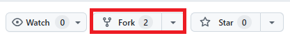
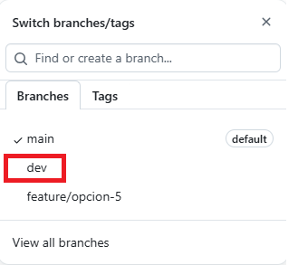
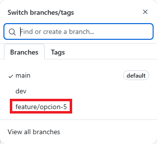
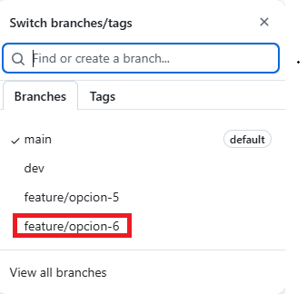
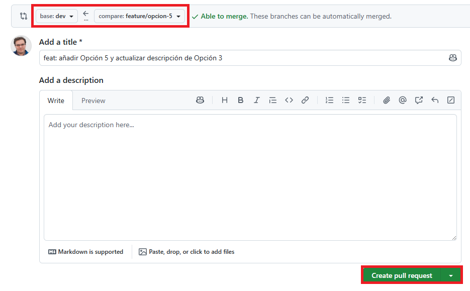
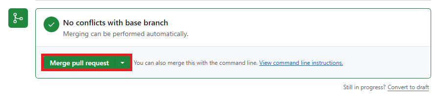

## Diario laboratorio Git

## Tarea 1 — Fork y configuración inicial

Primero hacemos un fork del repositorio original



Añado la rama upstream del repositorio original.

```git
git remote add upstream https://github.com/Lemoncode/punto-partida-practica-modulo-git.git
```

Y hacemos el comando para ver que tenemos tanto el repo original (`upstream`) como el `origin` nuestro.

```git
git remote -v
```

Creamos la rama `dev` desde `main` y la subimos.



## Tarea 2 — Feature branch A: añadir la Opción 5

Creamos la rama `feature/opcion-5` desde `dev` y la subimos al repositorio

Aplicamos los cambios tanto de añadir el siguiente objeto al array de `options`

```js
{
  id: 5,
  title: "Opción 5",
  description: "Pull Request",
  message:
    "Un Pull Request es una propuesta formal para incorporar cambios de una rama a otra. Permite revisar el código antes de mergear y deja un historial claro de qué se hizo y por qué.",
  featureFlag: false,
},
```

Y para el objeto `Opción 3` cambiamos el valor de la `description`

```js
description: "Flujo de trabajo",
```

Hacemos los siguientes comandos para subir los cambios.

```git
git add .
git commit -m "feat: añadir Opción 5 y actualizar descripción de Opción 3"
git push
```



## Tarea 3 — Feature branch B: añadir la Opción 6 (aquí está el conflicto)

Volvemos a `dev` y creamos la rama `feature/opcion-6`


## Tarea 4 — Pull Request 1: Feature A a dev y añadimos el siguiente objeto al array.

```Js
{
  id: 6,
  title: "Opción 6",
  description: "gitignore",
  message:
    "El fichero .gitignore le dice a Git qué ficheros debe ignorar. Úsalo para excluir ficheros de entorno (.env), dependencias (node_modules) y cualquier cosa que no deba estar en el repositorio.",
  featureFlag: false,
},
```

Y para el objeto `Opción 3` cambiamos el valor de la `description`

```js
description: "Flujo profesional",
```

Hacemos los siguientes comandos para subir los cambios.

```git
git add .
git commit -m "feat: añadir Opción 6 y actualizar descripción de Opción 3"
git push
```



## Tarea 4 — Pull Request 1: Feature A a dev

Creamos la pull request desde la `feature-5` a `dev`



Y mergeamos a dev los cambios.



**Importante** se puede borrar la rama.

Y actualizamos `dev`

```git
git pull origin dev
```

## Tarea 5 — Pull Request 2: Feature B a dev, conflicto

Creamos la rama `feature/opcion-6` hacia `dev`
